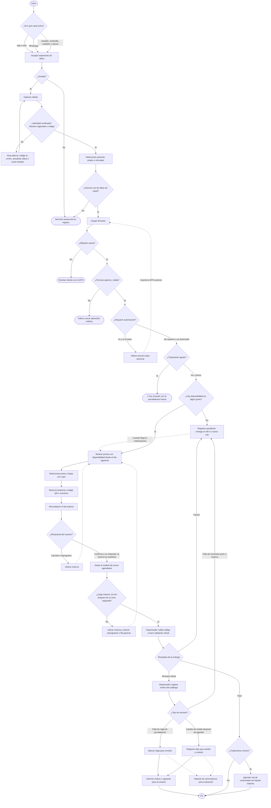

# Pharma Express — Documento de contexto para agentes de IA

> **Propósito de este archivo.** Dar a cualquier agente de IA (asistente de código, de redacción, de investigación o de diseño) el contexto completo y fiel del proyecto Pharma Express. Todo lo que aparece aquí proviene de lo definido por el equipo. Si algo no está en este documento, **no está decidido**: el agente debe preguntar en lugar de suponer.

---

## 0. Instrucciones para el agente (leer primero)

1. **Idioma:** responder y redactar en español (Colombia).
2. **No inventar datos.** Toda cifra, norma o hecho sobre el sistema de salud debe venir de una fuente verificable (literatura blanca o gris: informes oficiales, normativa, quejas, tutelas, derechos de petición, estudios, prensa). Si no hay fuente, decirlo explícitamente.
3. **Nada de ideas inalcanzables.** Las propuestas deben ser realizables por el equipo dentro del alcance de un prototipo.
4. **El equipo no tiene acceso directo a Disfarma.** Todo el proyecto se hace desde afuera: la línea base se construye con fuentes externas y los sistemas de la EPS, del gestor farmacéutico, de inventario, etc. **se simulan**.
5. **La prevalidación es preliminar.** Nunca presentarla como validación oficial; la validación oficial corresponde a la EPS y al gestor (y se hace en el punto, por el dispensador).
6. **Enfoque:** experiencia del usuario, contextualizado en Colombia y especialmente en Manizales, Caldas.
7. **Respetar la delimitación** (sección 4). No proponer soluciones al desabastecimiento, a las deudas entre actores, a la gestión interna de inventario del gestor ni a la validación oficial de derechos.
8. **Privacidad en WhatsApp:** las plantillas que envía el sistema (confirmación, recordatorio, cancelación) **no incluyen nombres de medicamentos ni diagnósticos**.
9. **El diagrama de flujo de la sección 7 es la fuente de verdad del comportamiento del sistema.** Cualquier código, historia de usuario o texto debe ser coherente con él.

---

## 1. Resumen del proyecto

- **Nombre:** Pharma Express.
- **Qué es:** un sistema multicanal de **pre-dispensación farmacéutica**.
- **Canales:** aplicación web o móvil, WhatsApp (API oficial de Meta) y un canal asistido (ventanilla, cuidador, asesor/facilitador comunitario).
- **Qué resuelve:** que el paciente conozca, **antes de desplazarse**, la validez preliminar de su solicitud y la disponibilidad de sus medicamentos, y que reciba una cita **solo cuando el medicamento esté reservado**.
- **Entregable:** un **prototipo funcional** de pre-dispensación, en un **entorno con sistemas externos simulados**.
- **Contexto geográfico:** puntos de dispensación del gestor farmacéutico **Disfarma** en **Manizales, Caldas** (afiliados de Salud Total y Sanitas).

---

## 2. Descripción del problema

En Colombia, el acceso a los medicamentos formulados se ha convertido en una de las principales barreras del sistema de salud. Las tutelas en salud pasaron de más de 265.000 en 2024 a alrededor de 312.500 en 2025, un aumento cercano al 17,92 %. Según la Defensoría del Pueblo, entre el 36 % y el 37 % de esas acciones se refieren a la entrega tardía o incompleta de medicamentos e insumos. En paralelo, la Superintendencia Nacional de Salud recibió 2.048.435 quejas en 2025; el principal motivo fue la negación de entrega de tecnologías o servicios ya autorizados, con 374.393 casos. La Defensoría aclara que no se trata de un desabastecimiento nacional sino de una demanda insatisfecha: los medicamentos existen en el país, pero no llegan al paciente por fallas logísticas, moras en los pagos y restricciones comerciales. Parte del problema, por tanto, está en la gestión del proceso de dispensación.

En los puntos de dispensación, esta situación se traduce en esperas prolongadas. La Defensoría reporta casos en que los usuarios han esperado hasta ocho horas para recibir sus tratamientos, y advierte que los indicadores de los gestores farmacéuticos no coinciden con lo observado en territorio. El impacto recae con mayor fuerza en pacientes crónicos: metformina, valsartán y losartán concentran el 25 % de los reportes de no entrega, y el 66 % de los casos corresponde a tratamientos cardiovasculares y metabólicos. Son personas que deben volver cada mes, así que la barrera se repite de forma permanente en su vida.

En Manizales, el gestor farmacéutico Disfarma atiende a afiliados de Salud Total y Sanitas. Estas dos EPS están entre las cinco que concentran el 68,16 % de los reclamos nacionales por no entrega, entrega inoportuna o incompleta de tecnologías en salud. Los entes de control han documentado de forma reiterada las fallas en la atención de Disfarma:

- **Enero de 2025.** En una mesa convocada por la Defensoría, la Personería contabilizó cerca de 74.000 medicamentos pendientes en todos los dispensarios de la ciudad, con esperas de 3 a 4 horas.
- **Noviembre de 2025.** En una inspección a la sede de la calle 62, la comitiva encontró 1.210 pendientes, medicamentos en estanterías que no llegaron a los pacientes y filas de cuatro a cinco horas.
- **Junio de 2026.** En la sede Centro, el retraso en la entrega de turnos se debió a una caída del sistema; el secretario de Salud reportó esperas de más de tres y cuatro horas, y se constató que a algunos usuarios se les negaban productos que sí estaban en el dispensario. Además, se hallaron 689 usuarios con medicamentos pendientes, incumpliendo el plazo de 48 horas de la Resolución 1604 de 2013.

A esto se suma que Manizales es una ciudad envejecida: sus cerca de 90 mil personas mayores ya representan el 20 % de la población, y se espera que en 2030 sean el 24 %. Son precisamente quienes más sufren las filas largas, la intemperie y los desplazamientos repetidos.

### 2.1 Causa específica que aborda el proyecto

Una causa específica de la espera es el momento y el lugar en que se valida la solicitud. Afiliación a la EPS, estado del usuario, vigencia y validez de la fórmula, autorizaciones, cobertura en el Plan de Beneficios en Salud (PBS) y disponibilidad del medicamento se verifican solo cuando el usuario llega a la ventanilla. El personal lo hace manualmente, consultando plataformas distintas según la EPS. Esta fragmentación tiene una explicación estructural: la interoperabilidad del ciclo de dispensación en Colombia sigue en construcción. Con la Circular 019 de 2026, los medicamentos financiados con la UPC pasaron a registrarse en el Resumen Digital de Atención, mientras los no financiados siguen por MIPRES, y la resolución que obligaría a EPS, gestores y operadores a reportar en tiempo real cada transacción de dispensación todavía está en preparación.

La consecuencia para el usuario es que no puede saber con anticipación si su fórmula será dispensable. Se entera después de horas de espera, y el costo puede ser alto: por ejemplo, cuando una fórmula está fuera de vigencia, la persona debe ser valorada nuevamente por el médico, lo que significa otra cita y otra fila. Esto ocurre aunque la normativa prohíbe trasladar trámites al usuario. Ningún trámite para obtener una autorización puede trasladarse al usuario (artículo 120 del Decreto Ley 019 de 2012), y las fórmulas tienen una vigencia no inferior a un mes. La propia prensa local recoge el caso de una usuaria que quiso preguntar si había el medicamento de su hijo antes de hacer la fila, para no perder tiempo, y aun así tuvo que esperar.

### 2.2 Soluciones existentes y su brecha

Las soluciones existentes no resuelven este punto. Otros gestores ya ofrecen turno virtual: Colsubsidio permite elegir fecha y lugar y recibir confirmación del turno, Cafam ofrece pre agendamiento adjuntando autorización u orden médica vigente y Audifarma tiene un turno virtual para avanzar en la espera sin estar presente. Estos sistemas agendan la hora, pero no le informan al usuario, antes de desplazarse, si su solicitud cumple los requisitos ni si el medicamento está apartado para él.

**Diferenciador de Pharma Express:** prevalidación anticipada + reserva del medicamento antes de asignar la cita.

### 2.3 Brecha tecnológica

Además, cualquier solución digital debe considerar la brecha tecnológica. WhatsApp es el canal digital más usado en el país, con un 92,1 % de uso entre usuarios de internet. Pero más de 2,8 millones de adultos mayores tienen dificultades para realizar trámites como solicitar citas médicas, y cerca de 1,8 millones viven en hogares con pobreza digital. Por eso, una solución que dependa solo de una aplicación dejaría por fuera a parte de la población más afectada.

---

## 3. Pregunta problema

¿Cómo puede un sistema multicanal de pre-dispensación permitir a los usuarios de puntos de dispensación en Manizales conocer, antes de desplazarse, la validez preliminar de su solicitud y la disponibilidad de sus medicamentos, de forma accesible también para personas con barreras de uso de tecnología?

---

## 4. Delimitación (qué NO hace el proyecto)

Pharma Express no busca resolver el desabastecimiento, las deudas entre actores del sistema, la gestión interna de inventario del gestor ni la validación oficial de derechos, que corresponde a las EPS. El problema que aborda es la ausencia de información anticipada y la validación tardía, centrada en la ventanilla, junto con sus efectos sobre el tiempo, los desplazamientos, la experiencia y la continuidad del tratamiento de los usuarios.

---

## 5. Objetivos

### 5.1 Objetivo general

Diseñar, desarrollar y evaluar, en un entorno con sistemas externos simulados, un prototipo funcional multicanal de pre-dispensación farmacéutica. El prototipo operará por aplicación web o móvil, por WhatsApp y por un canal asistido. Permitirá al paciente conocer antes de desplazarse la validez preliminar de su solicitud y la disponibilidad de sus medicamentos, y recibir una cita solo cuando el medicamento esté reservado. El propósito es reducir el tiempo de espera y los desplazamientos innecesarios, comparado con una línea base del proceso presencial en Manizales.

### 5.2 Objetivos específicos

1. **Caracterizar el proceso de dispensación desde la perspectiva del usuario y construir una línea base externa.** La línea base incluirá tiempos de permanencia y causas de rechazo o espera. Se construirá con:
   - Observación no participante fuera de los puntos de dispensación.
   - Encuesta de salida a usuarios.
   - Requisitos publicados por las EPS.
   - Informes de los entes de control.
   - Respuestas a derechos de petición.

2. **Definir y verificar reglas de prevalidación.** Las reglas cubrirán la vigencia de la fórmula, afiliación, cobertura en el PBS y estado de la autorización, y se derivarán de la normativa vigente. Se verificarán con un conjunto de casos de prueba documentados. La prevalidación será explícitamente preliminar y no sustituirá la validación oficial de la EPS ni del gestor.

3. **Implementar el inventario por punto de entrega, la reserva temporal y la agenda por franjas.** El módulo debe cumplir cuatro condiciones:
   - Asignar cita solo cuando el medicamento esté reservado.
   - No comprometer más existencias de las disponibles.
   - Respetar la capacidad de atención de cada punto.
   - Liberar automáticamente las reservas que expiren o se cancelen.

   Cuando no haya disponibilidad, el sistema registrará un pendiente, informará la ruta de entrega en 48 horas prevista en la Resolución 1604 de 2013 y avisará al usuario cuando el medicamento llegue.

4. **Implementar el canal de WhatsApp con la API oficial de Meta, usando el número de prueba en el prototipo.** El flujo seguirá el patrón observado en asistentes de EPS, con una mejora en el orden de los pasos:
   - Aviso de privacidad y aceptación del tratamiento de datos.
   - Ingreso del número de cédula.
   - Verificación de que el número de WhatsApp coincide con el teléfono registrado.
   - Despliegue del menú de opciones.
   - Autorización explícita y voluntaria para datos sensibles antes de cualquier acción que involucre la fórmula.

   Las plantillas que envíe el sistema (confirmación, recordatorio, cancelación) no incluirán nombres de medicamentos ni diagnósticos.

5. **Implementar un canal asistido para personas con barreras de uso de celular o WhatsApp.** Incluirá:
   - **Cita de continuidad en ventanilla.** El dispensador agenda la siguiente entrega y entrega un tiquete impreso.
   - **Números autorizados.** El paciente puede vincular los números de cuidadores, con su consentimiento registrado.
   - **Teléfonos compartidos.** Si un número atiende a varios pacientes, el sistema pregunta para quién es la gestión.
   - **Modo asesor.** Permite que un facilitador comunitario agende en nombre de varias personas.
   - **Ruta alterna.** Para usuarios cuyo número no coincide con el registrado.

   La atención presencial se mantiene como opción disponible en todos los casos.

6. **Permitir al personal dispensador cerrar cada entrega como total, parcial o pendiente**, con trazabilidad del estado y validación del código de entrega (QR o numérico).

7. **Incorporar protección de datos y accesibilidad desde el diseño.**
   - Consentimiento conforme a la Ley 1581 de 2012 y al Decreto 1377 de 2013, separando la autorización general de la de datos sensibles.
   - Minimización de los datos que circulan por WhatsApp.
   - Criterios de accesibilidad de WCAG 2.1 nivel AA como referencia voluntaria.

8. **Evaluar el prototipo mediante escenarios de uso y métricas definidas, comparándolo con la línea base:**
   - Tiempo estimado de espera y número de desplazamientos evitados.
   - Porcentaje de novedades detectadas antes del desplazamiento.
   - Tasa de éxito por tarea y puntaje SUS, con al menos un grupo de adultos mayores.
   - Cero sobre-reservas en pruebas de concurrencia.
   - Resolución correcta de los escenarios de cuidador, teléfono compartido y cambio de número.

---

## 6. Actores del sistema

| Actor | Rol en el flujo |
|---|---|
| Paciente | Usuario principal; entra por app/web, WhatsApp o canal asistido. |
| Cuidador (número autorizado) | Gestiona a nombre del paciente, con consentimiento registrado del paciente. |
| Facilitador comunitario (modo asesor) | Agenda en nombre de varias personas. |
| Dispensador (personal del punto) | Agenda citas de continuidad en ventanilla, valida el código de entrega, hace la validación oficial y cierra la entrega (total, parcial, pendiente o rechazo con motivo de catálogo). |
| EPS (simulada) | Fuente de afiliación, estado del usuario y autorizaciones; responsable de la validación oficial de derechos. |
| Gestor farmacéutico / inventario por punto (simulado) | Fuente de disponibilidad por punto de entrega. |

---

## 7. Flujo del sistema (fuente de verdad)

### 7.1 Reglas de negocio que se leen del flujo

Estas reglas son una lectura literal del diagrama, para facilitar su implementación:

**Entrada y consentimiento**
- Los tres canales (app/web, WhatsApp, asistido) convergen en el mismo paso: aceptar el tratamiento de datos.
- Si el usuario no acepta el tratamiento de datos → atención presencial sin registro.
- Identidad: se verifica por número registrado o por código. Si falla → ruta alterna (código al correo, actualizar datos o canal asistido) y se vuelve a ingresar la cédula.
- Tras verificar identidad se selecciona el paciente: propio o vinculado.
- Si no autoriza el uso de datos de salud → atención presencial sin registro. La autorización de datos de salud va **antes** de cargar fórmulas.

**Prevalidación (en este orden)**
1. Afiliación activa. No → orientar trámite con la EPS (fin del flujo digital).
2. Fórmula vigente y válida. No → indicar nueva valoración médica (fin del flujo digital).
3. Autorización. Si la requiere y no la tiene → indicar el proceso para autorizar; cuando la EPS autoriza, se vuelve a cargar fórmulas.
4. Tipo de tratamiento:
   - **Agudo** → ir hoy al punto con la prevalidación hecha (no se agenda cita ni se reserva).
   - **Crónico** → sigue a disponibilidad y reserva.

**Disponibilidad, reserva y agenda (tratamiento crónico)**
- Sin disponibilidad en ningún punto → registrar pendiente (entrega en 48 h o nueva cita). Cuando llega el medicamento → se muestran puntos con disponibilidad.
- Con disponibilidad → mostrar puntos con disponibilidad **desde el día siguiente**.
- El usuario selecciona punto y franja **con cupo**.
- Se crea una reserva temporal y un código de entrega (QR o numérico).
- Recordatorio el día anterior:
  - Cancela o reprograma → liberar reserva y volver a mostrar puntos.
  - Confirma **o no responde** → la reserva se mantiene.
- El usuario asiste al módulo de turnos agendados.
- Tolerancia de llegada: **máximo 10 minutos después de la hora asignada**. Si llega más tarde → liberar reserva y ofrecer reprogramar o fila general.

**Entrega en el punto**
- El dispensador valida el código y hace la validación oficial.
- Resultados posibles:
  - **Total** → si es tratamiento crónico, agendar cita de continuidad con tiquete impreso; si no, fin.
  - **Parcial** → registrar pendiente.
  - **Rechazo oficial** → el dispensador registra el motivo desde un catálogo, y según el tipo:
    - Falla de regla de prevalidación → marcar la regla para revisión.
    - Cambio de estado después de agendar → registrar qué dato cambió y cuándo.
    - Falla de inventario pese a la reserva → registrar pendiente.
  - En los dos primeros tipos de rechazo se informa el motivo y el siguiente paso al usuario, y se alimenta el **reporte de concordancia para evaluación** (métrica del objetivo 8).

---

## 8. Glosario

- **Pre-dispensación:** gestión previa a la entrega del medicamento (prevalidación, reserva y cita) que ocurre antes de que el usuario se desplace.
- **Prevalidación:** verificación preliminar de afiliación, vigencia y validez de la fórmula, autorización y cobertura PBS. No sustituye la validación oficial.
- **Validación oficial:** la que hace el dispensador en el punto, a nombre de la EPS y el gestor.
- **Pendiente:** medicamento no entregado total o parcialmente; debe entregarse en máximo 48 horas (Resolución 1604 de 2013).
- **Reserva temporal:** existencias apartadas para un paciente en un punto y franja; se libera si expira o se cancela.
- **Franja:** bloque de horario con capacidad de atención limitada por punto.
- **Cita de continuidad:** la siguiente entrega de un paciente crónico, agendada en ventanilla con tiquete impreso.
- **PBS:** Plan de Beneficios en Salud.
- **UPC:** Unidad de Pago por Capitación.
- **RDA:** Resumen Digital de Atención.
- **MIPRES:** plataforma de prescripción de tecnologías no financiadas con la UPC.
- **SUS:** System Usability Scale.
- **Sobre-reserva:** comprometer más existencias de las disponibles (debe ser cero en pruebas de concurrencia).

---

## 9. Referencias

### Informes y comunicados oficiales
- Defensoría del Pueblo. (2025, 29 de enero). *Defensoría lidera mesa de trabajo en Manizales para garantizar entrega oportuna de medicamentos a afiliados de EPS Sanitas* [Comunicado de prensa]. https://www.defensoria.gov.co/-/defensor%C3%ADa-lidera-mesa-de-trabajo-en-manizales-para-garantizar-entrega-oportuna-de-medicamentos-a-afiliados-de-eps-sanitas
- Defensoría del Pueblo. (2026, 23 de abril). *Tutelas para invocar la protección del derecho a la salud tuvieron un aumento cercano al 18 % en el país* [Comunicado de prensa]. https://www.defensoria.gov.co/web/guest/-/tutelas-para-invocar-la-proteccion-del-derecho-a-la-salud
- Secretaría de Salud de Manizales. (2026, 12 de junio). *Secretaría de Salud de Manizales mantiene seguimiento a entrega de medicamentos de las EPS*. Alcaldía de Manizales, Centro de Información. https://centrodeinformacion.manizales.gov.co/secretaria-de-salud-de-manizales-mantiene-seguimiento-a-entrega-de-medicamentos-de-las-eps-por-una-atencion-digna-y-oportuna/
- Fundación Luker. (2024). *Economía plateada* (Serie Qué funciona para el desarrollo, No. 2). https://fundacionluker.org.co/wp-content/uploads/2024/04/desarrollo-02-economia-plateada-buenas-practicas-funluker.pdf

### Normativa
- Congreso de la República de Colombia. (2012). *Ley Estatutaria 1581 de 2012*, por la cual se dictan disposiciones generales para la protección de datos personales. https://www.funcionpublica.gov.co/eva/gestornormativo/norma.php?i=49981
- Presidencia de la República de Colombia. (2012). *Decreto Ley 019 de 2012*, por el cual se dictan normas para suprimir o reformar regulaciones, procedimientos y trámites innecesarios existentes en la Administración Pública (art. 120). Consultado en la compilación de la Resolución 4331 de 2012 del Invima (ver abajo).
- Ministerio de Salud y Protección Social. (2012). *Resolución 4331 de 2012*. Compilación jurídica del Invima. https://normograma.invima.gov.co/compilacion/docs/resolucion_minsaludps_4331_2012.htm
- Presidencia de la República de Colombia. (2013). *Decreto 1377 de 2013*, por el cual se reglamenta parcialmente la Ley 1581 de 2012. https://www.funcionpublica.gov.co/eva/gestornormativo/norma.php?i=53646
- Ministerio de Salud y Protección Social. (2013). *Resolución 1604 de 2013* [Entrega de medicamentos pendientes en un plazo máximo de 48 horas]. Reseña en Función Pública: https://www1.funcionpublica.gov.co/noticias/-/asset_publisher/mQXU1au9B4LL/content/ministerio-de-salud-reglamenta-articulo-131-del-decreto-ley-019-de-2012-en-materia-de-entrega-oportuna-de-medicamentos
- Ministerio de Tecnologías de la Información y las Comunicaciones. (2020). *Resolución 1519 de 2020, Anexo 1: Directrices de accesibilidad web*. https://gobiernodigital.mintic.gov.co/692/articles-160770_Directrices_Accesibilidad_web.pdf
- World Wide Web Consortium. (2018). *Web Content Accessibility Guidelines (WCAG) 2.1*. https://www.w3.org/TR/WCAG21/

### Análisis sectorial y prensa
- Moreno González, N. (2025, 5 de noviembre). Radiografía de la Defensoría del Pueblo: el 90 % de los pacientes no recibe sus medicamentos y las tutelas por salud aumentaron un 34 % en el último año. *Consultorsalud*. https://consultorsalud.com/defensoria-del-pueblo-pacientes-medicamentos/
- Plan de acción obligatorio: Supersalud exige a EPS mejorar dispensación de medicamentos a pacientes con condiciones especiales. (2025, 25 de febrero). *Consultorsalud*. https://consultorsalud.com/supersalud-exige-eps-dispensacion-medicamentos/
- Supersalud dice que en 2026 ha cerrado 514.000 quejas de usuarios; ¿cuáles fueron? (2026, 24 de marzo). *El Colombiano*. https://www.elcolombiano.com/colombia/salud/supersalud-2026-cerro-514000-quejas-usuarios-OH34884578
- Defensoría advierte que persisten filas, medicamentos pendientes y barreras de acceso para afiliados de Nueva EPS. (2026, 6 de marzo). *El Tiempo*. https://www.eltiempo.com/salud/defensoria-advierte-que-persisten-filas-medicamentos-pendientes-y-barreras-de-acceso-para-afiliados-de-nueva-eps-3538042
- Rojas, E. R. (2025, 18 de noviembre). Disfarma bajo la lupa: usuarios sufren largas filas y problemas en el servicio de medicamentos. *La Patria*. https://www.lapatria.com/salud/disfarma-bajo-la-lupa-usuarios-sufren-largas-filas-y-problemas-en-el-servicio-de-medicamentos
- Rojas, E. R. (2026, 10 de junio). Crisis en Disfarma: usuarios de esta EPS enfrentan largas filas y falta de medicamentos en Manizales. *La Patria*. https://www.lapatria.com/salud/crisis-en-disfarma-usuarios-de-esta-eps-enfrentan-largas-filas-y-falta-de-medicamentos-en
- Secretaría de Salud de Manizales detecta fallas en entrega de medicamentos a usuarios de EPS Salud Total. (2026, 13 de junio). *BC Noticias*. https://www.bcnoticias.com.co/secretaria-de-salud-de-manizales-detecta-fallas-en-entrega-de-medicamentos-a-usuarios-de-eps-salud-total/
- RDA de dispensación de medicamentos en Colombia. (2026, 20 de mayo). *Consultorsalud*. https://consultorsalud.com/rda-de-dispensacion-de-medicamentos-en-colombia/
- Saludtools. (2026). *MIPRES y medicamentos UPC en 2026: por qué se cayó la Circular 044 y llega el RDA*. https://www.saludtools.com/articulo/mipres-2026-medicamentos-upc-circular-044-colombia
- Uso de redes sociales en Colombia. (2025, 1 de diciembre). *Marketing4eCommerce Colombia*. https://marketing4ecommerce.co/uso-de-redes-sociales-en-colombia-2/
- Adultos mayores y brecha digital: guía para reducir riesgos en banca, salud y trámites. (2026, 24 de febrero). *Yahoo Noticias*. https://es-us.noticias.yahoo.com/adultos-mayores-brecha-digital-gu%C3%ADa-224825871.html

### Páginas institucionales de EPS, gestores y plataformas
- EPS Sanitas. (s.f.). *Medicamentos*. Recuperado el 21 de septiembre de 2026, de https://www.epssanitas.com/usuarios/en/web/nuevo-portal-eps/medicamentos
- Nueva EPS. (s.f.). *¿Cómo reclamar mis medicamentos?* Recuperado el 21 de septiembre de 2026, de https://nuevaeps.com.co/coronavirus-atencion/como-reclamar-medicamentos
- Nueva EPS. (s.f.). *Y mis medicamentos*. Recuperado el 21 de septiembre de 2026, de https://www.nuevaeps.com.co/Y-mis-medicamentos
- Audifarma. (s.f.). *Solicita tu turno virtual y ahorra tiempo*. Recuperado el 21 de septiembre de 2026, de https://audifarma.com.co/blog/audifarma-a-tu-lado/solicita-tu-turno-virtual-y-ahorra-tiempo
- WhatsApp. (2026). *WhatsApp Business Messaging Policy*. Recuperado el 21 de septiembre de 2026, de https://whatsappbusiness.com/policy/
