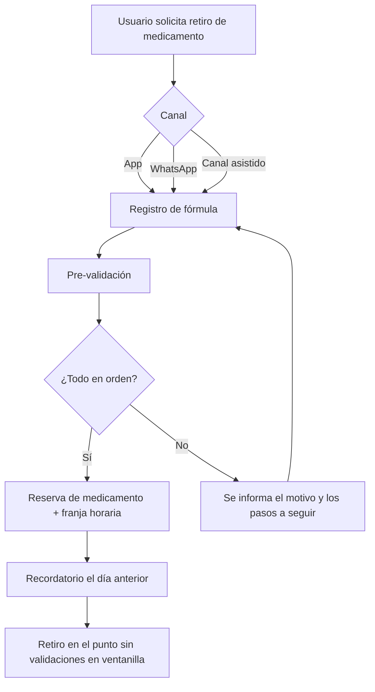

# Pharma Express 

**Prototipo funcional de pre-dispensación de medicamentos para reducir los tiempos de espera en los puntos de dispensación de Manizales, Caldas.**

> Proyecto académico independiente. No tiene afiliación, convenio ni acceso a los sistemas de Disfarma, de las EPS ni de ninguna entidad del sistema de salud. Todos los sistemas externos del prototipo son **simulados** y todos los datos son **ficticios**.

---

## Tabla de contenido

- [Pharma Express](#pharma-express)
  - [Tabla de contenido](#tabla-de-contenido)
  - [El problema](#el-problema)
  - [La propuesta](#la-propuesta)
  - [Alcance del prototipo](#alcance-del-prototipo)
  - [Funcionalidades](#funcionalidades)
  - [Flujo del usuario](#flujo-del-usuario)
  - [Arquitectura](#arquitectura)
  - [Sistemas externos simulados](#sistemas-externos-simulados)
  - [Estructura del repositorio](#estructura-del-repositorio)
  - [Instalación y ejecución](#instalación-y-ejecución)
  - [Consideraciones éticas y de datos](#consideraciones-éticas-y-de-datos)

---

## El problema

En los puntos de dispensación de Disfarma en Manizales, los usuarios pueden esperar horas para recibir sus medicamentos. Buena parte de esa espera ocurre porque **todas las validaciones se hacen en ventanilla, en el momento de la atención**:

- Afiliación activa a la EPS y estado del usuario.
- Vigencia y validez de la fórmula médica.
- Autorizaciones requeridas.
- Cobertura dentro del Plan de Beneficios en Salud (PBS).
- Disponibilidad del medicamento en el punto.

Estas verificaciones las realiza el personal en plataformas distintas según la EPS, y **el usuario no conoce el resultado hasta que llega a la ventanilla**. Si falta una autorización, la fórmula venció o el medicamento no está disponible, la persona pierde el viaje y la espera.

El problema se sustenta con literatura blanca y gris verificable (quejas, tutelas, derechos de petición, estudios e informes). Ver [Fundamentación y fuentes](#fundamentación-y-fuentes).

## La propuesta

Pharma Express traslada las validaciones **antes** de la visita al punto de dispensación:

1. El usuario agenda su retiro con **un día de anticipación**.
2. El sistema ejecuta la pre-validación (afiliación, fórmula, autorizaciones, cobertura, disponibilidad) contra servicios simulados.
3. Si todo está en orden, se **reserva** el medicamento y se asigna una franja horaria.
4. Si algo falla, el usuario recibe el motivo y qué debe hacer, **antes de desplazarse**.

La solución contempla tres canales para no dejar a nadie por fuera:

| Canal | Público |
|---|---|
| Aplicación (web/móvil) | Usuarios con smartphone y manejo digital |
| WhatsApp | Usuarios que prefieren un canal conversacional conocido |
| Canal alternativo asistido | Personas que no usan celular o WhatsApp por edad o escolaridad |

## Alcance del prototipo

**Incluye**

- Prototipo funcional del flujo de pre-dispensación de extremo a extremo.
- Servicios simulados (mocks) que imitan las validaciones de EPS, fórmulas, cobertura e inventario.
- Integración de demostración con WhatsApp.
- Una propuesta implementada o prototipada del canal alternativo.
- Datos de prueba ficticios.

**No incluye**

- Conexión con sistemas reales de Disfarma, EPS, ADRES u otras entidades.
- Manejo de datos reales de pacientes.
- Despliegue en producción.

## Funcionalidades

- [ ] Registro e identificación del usuario (datos ficticios).
- [ ] Carga o registro de la fórmula médica.
- [ ] Pre-validación automática con resultado explicado en lenguaje sencillo.
- [ ] Agendamiento con un día de anticipación y selección de franja horaria.
- [ ] Reserva de medicamentos en el punto de dispensación.
- [ ] Notificaciones y recordatorios.
- [ ] Flujo conversacional por WhatsApp.
- [ ] Canal alternativo para usuarios sin celular/WhatsApp.
- [ ] Panel del punto de dispensación para ver citas y reservas del día.

## Flujo del usuario



## Arquitectura

> La tecnología concreta está por definir; esta sección describe los componentes previstos.

```
┌───────────────┐   ┌───────────────┐   ┌──────────────────┐
│  App web/móvil│   │   WhatsApp    │   │ Canal asistido   │
└───────┬───────┘   └───────┬───────┘   └────────┬─────────┘
        └───────────────────┼────────────────────┘
                            ▼
                ┌───────────────────────┐
                │   Backend / API       │
                │  - Agendamiento       │
                │  - Motor de           │
                │    pre-validación     │
                │  - Reservas           │
                │  - Notificaciones     │
                └───────────┬───────────┘
                            ▼
        ┌───────────────────────────────────────┐
        │   Servicios externos SIMULADOS        │
        │ EPS · Fórmulas · Autorizaciones ·     │
        │ Cobertura PBS · Inventario            │
        └───────────────────────────────────────┘
```

## Sistemas externos simulados

Como el equipo no tiene acceso a los sistemas reales, cada validación se implementa como un servicio simulado con respuestas configurables, para poder demostrar tanto los casos exitosos como los fallidos.

| Servicio simulado | Qué responde | Casos de prueba sugeridos |
|---|---|---|
| Afiliación EPS | Estado de afiliación del usuario | Activo, suspendido, retirado |
| Fórmula médica | Vigencia y validez | Vigente, vencida, incompleta |
| Autorizaciones | Si el medicamento requiere autorización y si existe | Aprobada, pendiente, inexistente |
| Cobertura PBS | Si el medicamento está cubierto | Cubierto, no cubierto |
| Inventario | Disponibilidad en el punto | Disponible, agotado, parcial |

## Estructura del repositorio

> Estructura propuesta; ajustar cuando se defina el stack.

```
pharma-express/
├── app/                 # Aplicación del usuario (web/móvil)
├── backend/             # API, motor de pre-validación, reservas
├── whatsapp/            # Integración y flujos conversacionales
├── canal-asistido/      # Alternativa para usuarios sin celular/WhatsApp
├── mocks/               # Servicios externos simulados
├── data/                # Datos ficticios de prueba
├── docs/                # Documentación, diagramas, fuentes
└── README.md
```

## Instalación y ejecución
```bash
# Clonar el repositorio
git clone https://github.com/NaghellyMoreno/PharmaExpress.git
cd pharma-express
```

## Consideraciones éticas y de datos

- El prototipo usa **exclusivamente datos ficticios**.
- Cualquier evolución que maneje datos reales debería cumplir la normativa colombiana de protección de datos personales (Ley 1581 de 2012) y las reglas aplicables a la información en salud.
- El diseño prioriza la **inclusión**: lenguaje sencillo, canal asistido y accesibilidad para personas mayores o con baja escolaridad.
- Los resultados de la pre-validación son informativos dentro del prototipo; no reemplazan la decisión del personal de dispensación.