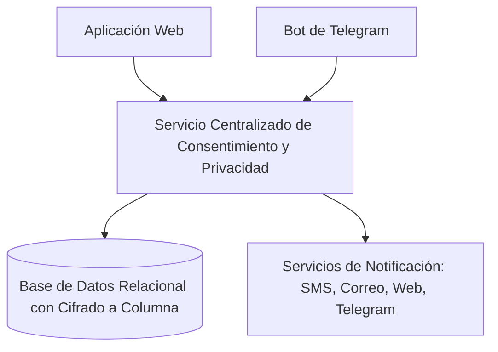

<!--
Agente: Architecture Agent
Proveedor: gemini
Modelo: gemini-3.5-flash-lite
Fecha: 2026-10-07 19:54
Petición: Analiza la arquitectura
-->

# ARQ-003. Arquitectura para la gestión de privacidad, consentimiento y autorización de datos - Versión 1.0

Estado: Aprobada y congelada
Modo: Propuesta
SPECs de origen: SPEC-001, SPEC-003, SPEC-004, SPEC-005

## Resumen de la decisión
Se propone un monolito modular con un servicio centralizado de gestión unificada y una base de datos relacional con cifrado a nivel de columna para proteger los registros de consentimiento, autorización de datos de salud y revocación en la aplicación web y el bot de Telegram.

## Architecture Drivers
- Driver: Seguridad y cumplimiento normativo de datos sensibles. Pregunta: cómo proteger legal y técnicamente los datos sensibles de salud y los registros de consentimiento. Origen: SPEC-001/RNF-001, SPEC-003/RNF-003, SPEC-004/RNF-004, SPEC-005/RNF-005, contexto 3.11.
- Driver: Mantenibilidad y simplicidad en un equipo pequeño. Pregunta: cómo estructurar el sistema para que cuatro desarrolladores puedan implementarlo en ocho semanas sin complejidad innecesaria. Origen: contexto 3.9.
- Driver: Interoperabilidad multicanal centralizada. Pregunta: cómo gestionar de forma unificada las interacciones de la aplicación web y Telegram para el aviso de privacidad, las autorizaciones y las notificaciones. Origen: SPEC-001/RF-004, SPEC-003/RF-010, SPEC-004/RF-012, SPEC-005/RF-015, contexto 3.1 y 3.6.

## Restricciones arquitectónicas
- El equipo consta de cuatro personas y cuenta con aproximadamente 8 semanas para el desarrollo. Origen: contexto 3.9.
- El equipo no tiene acceso a los sistemas de Disfarma y trabaja desde afuera. Origen: contexto 3.9.
- Ley 1581 de 2012 y Decreto 1377 de 2013: los datos de salud son sensibles y requieren autorización explícita del titular. Origen: contexto 3.11.
- Decreto Ley 019 de 2012, artículo 131, y Resolución 1604 de 2013: la entrega incompleta y la entrega en 48 horas son obligaciones de la EPS y su red, no de Pharma Express. Origen: contexto 3.11.
- Decreto Ley 019 de 2012, artículo 120: prohíbe trasladar al usuario trámites de autorización. Origen: contexto 3.11.

## Atributos de calidad
- Atributo: Seguridad y privacidad. Condición: los datos sensibles de salud y los registros de aceptación y revocación deben almacenarse con cifrado a nivel de columna y control estricto de acceso. Origen: SPEC-001/RNF-001, SPEC-003/RNF-003, SPEC-004/RNF-004, SPEC-005/RNF-005.
- Atributo: Mantenibilidad y simplicidad. Condición: el diseño debe permitir el desarrollo ágil por un equipo de cuatro personas en ocho semanas mediante un servicio centralizado unificado. Origen: contexto 3.9, respuesta ARCH-Q-002.

## Preguntas de aclaración
- ARCH-Q-001. Las SPECs adjuntas (SPEC-001, SPEC-003, SPEC-004 y SPEC-005) establecen el manejo del aviso de privacidad, el registro detallado de aceptación, la autorización separada de datos de salud y la revocatoria del consentimiento, pero ninguna especifica la estrategia de persistencia ni el esquema de cifrado que debe proteger estos registros de datos sensibles de salud. ¿El sistema debe utilizar una base de datos relacional con cifrado a nivel de columna para los datos sensibles, o es suficiente un almacenamiento relacional estándar con control de acceso por sesión durante el prototipo?
  Por qué importa: define el diseño del componente de persistencia y el nivel de complejidad del modelo de almacenamiento para cumplir con la Ley 1581 de 2012 (contexto 3.11) dentro del tiempo de desarrollo disponible (contexto 3.9).
  Crítica: sí
  Estado: Respondida (respuesta del equipo)
  Responsable: equipo
- ARCH-Q-002. La SPEC-001 y la SPEC-004 exigen que la aceptación del aviso de privacidad y la autorización de datos de salud se presenten y registren de manera independiente por plataforma (aplicación web y bot de Telegram), y la SPEC-005 exige notificar la revocatoria por todos los medios del paciente. ¿La arquitectura debe modelar la sesión y el canal de forma desacoplada mediante un adaptador de mensajería independiente para Telegram y otro para la Web, o se prefiere un servicio centralizado que gestione ambos canales de manera unificada?
  Por qué importa: determina si la estructura del sistema adoptará un patrón de adaptadores por canal (Ports and Adapters) o un núcleo monolítico directo, impactando la testabilidad y la mantenibilidad frente a los canales externos reales de Telegram, SMS y correo (contexto 2.3 y 3.1).
  Crítica: sí
  Estado: Respondida (respuesta del equipo)
  Responsable: equipo

## Alternativas consideradas
- Alternativa: Microservicios distribuidos con bases de datos independientes por canal y cifrado de transporte. Descripción: dividir la aplicación en microservicios separados para la web, Telegram y la gestión de consentimiento, comunicados por red interna. Ventajas: alta modularidad y escalabilidad independiente. Desventajas: alta complejidad operativa, excesiva sobrecarga para un equipo de cuatro personas en ocho semanas y riesgo en la consistencia de los registros normativos.
- Alternativa: Monolito modular con servicio centralizado unificado y base de datos relacional con cifrado a nivel de columna. Descripción: una única aplicación estructurada en módulos internos que utiliza un servicio centralizado para manejar de forma unificada las solicitudes de la web y Telegram, respaldada por una base de datos relacional con cifrado a nivel de columna para datos sensibles. Ventajas: menor complejidad de despliegue, alineación perfecta con las restricciones de tiempo y equipo, control centralizado de la seguridad y cumplimiento normativo estricto. Desventajas: acoplamiento interno mayor que en microservicios.

## Matriz de decisión
| Alternativa | Mantenibilidad (0.3) | Seguridad (0.3) | Complejidad (0.2) | Tiempo (0.2) | Total |
|---|---|---|---|---|---|
| Microservicios distribuidos | 2 | 4 | 2 | 2 | 2.6 |
| Monolito modular con servicio centralizado | 4 | 4 | 4 | 4 | 4.0 |

Pesos justificados: la seguridad pesa 0.3 debido a la exigencia legal de la Ley 1581 de 2012 (contexto 3.11) y el cifrado a nivel de columna; la mantenibilidad pesa 0.3 por el equipo de cuatro personas y ocho semanas (contexto 3.9); la complejidad y el tiempo pesan 0.2 cada uno para asegurar la viabilidad del prototipo funcional.

## Arquitectura seleccionada
- Decisión: Monolito modular con un servicio centralizado unificado y base de datos relacional con cifrado a nivel de columna.
- Por qué: responde directamente a las decisiones del equipo en las preguntas ARCH-Q-001 y ARCH-Q-002, cumpliendo con la Ley 1581 de 2012 mediante cifrado a nivel de columna y garantizando la viabilidad del desarrollo con cuatro personas en ocho semanas (contexto 3.9).
- ADR: ADR-001.

## Diagrama conceptual

## Componentes y responsabilidades
- COMP-001. Servicio Centralizado de Consentimiento y Privacidad: gestiona de forma unificada la presentación del aviso de privacidad, la autorización separada de datos de salud, el registro de aceptación (titular o tercero, fecha y canal) y la revocación con eliminación de datos y reservas. Traza a: SPEC-001/RF-001, SPEC-003/RF-010, SPEC-004/RF-012, SPEC-005/RF-015, Driver Interoperabilidad multicanal centralizada, ADR-001.
- COMP-002. Módulo de Persistencia Cifrada: administra el almacenamiento relacional aplicando cifrado a nivel de columna para los datos sensibles y el control de integridad de los registros de aceptación y revocación. Traza a: SPEC-003/RNF-003, SPEC-004/RNF-004, Driver Seguridad y cumplimiento normativo, ADR-001.
- COMP-003. Adaptador de Notificaciones Multicanal: canaliza y despacha las confirmaciones de revocación y avisos a través de la web, Telegram, SMS y correo electrónico. Traza a: SPEC-005/RF-018, Driver Interoperabilidad multicanal centralizada, ADR-001.

## Integraciones y flujos técnicos
- Flujo de presentación y aceptación de aviso de privacidad y autorización de datos de salud: el usuario interactúa desde la aplicación web o Telegram; el servicio centralizado valida el estado, muestra los términos correspondientes, captura la aceptación con su rol (titular/tercero), fecha y canal, y el módulo de persistencia almacena los datos cifrados a nivel de columna. Origen: SPEC-001/RF-001 a RF-004, SPEC-003/RF-010, SPEC-004/RF-012 a RF-014.
- Flujo de revocación de consentimiento: el usuario solicita la revocación desde cualquier canal; el servicio centralizado procesa la solicitud, marca el registro como revocado en la base de datos cifrada, elimina las reservas activas asociadas y activa el adaptador de notificaciones para enviar la confirmación por todos los medios del paciente. Origen: SPEC-005/RF-015 a RF-018.

## ADR
- ADR-001. Adopción de monolito modular con servicio centralizado y base de datos con cifrado a nivel de columna
  Estado: Propuesta
  Contexto: Pharma Express requiere cumplir con la Ley 1581 de 2012 para el tratamiento de datos sensibles de salud mediante aviso de privacidad, autorización separada y registros auditables, operando con un equipo de cuatro personas en ocho semanas.
  Problema: cómo estructurar el sistema para garantizar la seguridad de los datos sensibles y la gestión unificada de canales (web y Telegram) sin sobrepasar la capacidad de desarrollo del equipo.
  Alternativas: microservicios distribuidos con bases de datos independientes; monolito modular con servicio centralizado unificado y base de datos con cifrado a nivel de columna.
  Decisión: monolito modular con servicio centralizado unificado y base de datos relacional con cifrado a nivel de columna.
  Justificación: responde a las respuestas del equipo a ARCH-Q-001 y ARCH-Q-002, asegurando el cumplimiento legal (contexto 3.11) y la viabilidad técnica en el tiempo estipulado (contexto 3.9).
  Consecuencias positivas: simplicidad operativa, control centralizado de la seguridad, facilidad de prueba y cumplimiento estricto de la normativa de protección de datos.
  Consecuencias negativas: mayor acoplamiento interno en comparación con una arquitectura de microservicios pura.
  Supuestos: el motor de base de datos relacional seleccionado soporta nativamente o mediante extensiones confiables el cifrado a nivel de columna.
  Evidencia: contexto 3.9, contexto 3.11, SPEC-001, SPEC-003, SPEC-004, SPEC-005.

## Decisiones de diseño y patrones
- Patrón Repository: para abstraer el acceso a la base de datos relacional y aislar las operaciones de cifrado a nivel de columna de la lógica de negocio del servicio centralizado. Traza a: SPEC-003/RF-010, SPEC-004/RF-012.

## Riesgos técnicos
- Riesgo: Impacto en el rendimiento de las consultas debido al cifrado y descifrado constante a nivel de columna en la base de datos. Impacto: medio. Probabilidad: baja. Mitigación: utilizar claves simétricas eficientes y limitar el cifrado exclusivamente a los campos de datos sensibles y registros de identificación de consentimiento.
- Riesgo: Pérdida o compromiso de las llaves de cifrado de la base de datos. Impacto: alto. Probabilidad: baja. Mitigación: gestión segura de credenciales y variables de entorno fuera del código fuente del prototipo.

## Supuestos
- El entorno de desarrollo y pruebas dispone de una base de datos relacional con capacidad de cifrado a nivel de columna. Requiere validación: equipo de desarrollo y planning/QA.

## Preguntas técnicas abiertas
- Ninguna.

## Trazabilidad
- SPEC-001/RF-001 → Driver Interoperabilidad multicanal → ADR-001 → COMP-001 → Implementación/TEST (pendiente de Planning/QA).
- SPEC-003/RF-010 → Driver Seguridad y cumplimiento normativo → ADR-001 → COMP-001, COMP-002 → Implementación/TEST (pendiente de Planning/QA).
- SPEC-004/RF-012 → Driver Seguridad y cumplimiento normativo → ADR-001 → COMP-001, COMP-002 → Implementación/TEST (pendiente de Planning/QA).
- SPEC-005/RF-015 → Driver Interoperabilidad multicanal → ADR-001 → COMP-001, COMP-003 → Implementación/TEST (pendiente de Planning/QA).

## Verificación
- Completitud: cumple. Todas las secciones requeridas cuentan con contenido detallado y específico para las SPECs procesadas.
- Consistencia con las SPECs: cumple. Cada driver, requisito y componente se alinea exactamente con SPEC-001, SPEC-003, SPEC-004 y SPEC-005.
- No invención: cumple. Las decisiones tecnológicas se basan estrictamente en las respuestas del equipo a las preguntas ARCH-Q y en el contexto del producto.
- Justificación: cumple. Las alternativas fueron comparadas mediante criterios ponderados justificados por los drivers y restricciones del proyecto.
- Defensa: cumple. Cada decisión está documentada en un ADR y puede ser explicada por el equipo sin depender de la IA.

## Historial de cambios
- Versión 0.1: estudio de análisis inicial.
- Versión 1.0: propuesta completa incorporando las respuestas del equipo a las preguntas ARCH-Q.

## Siguiente paso
La ARQ-003 versión 1.0 está lista para revisión. Confirmen la propuesta o pidan correcciones con --continuar ARQ-003.
