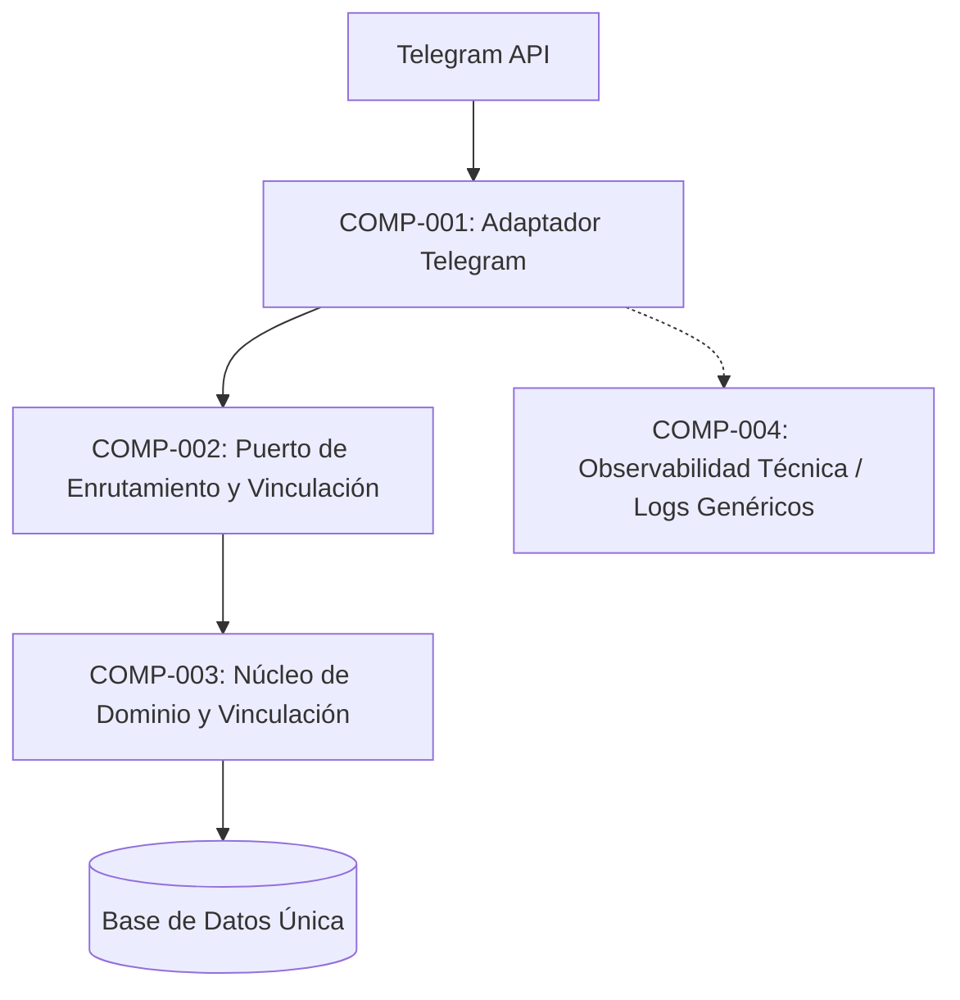

<!--
Agente: Architecture Agent
Proveedor: gemini
Modelo: gemini-3.5-flash-lite
Fecha: 2026-10-07 20:37
Petición: Analiza la arquitectura
-->

# ARQ-004. Arquitectura de Integración y Enrutamiento del Canal Telegram - Versión 1.0

Estado: Aprobada y congelada
Modo: Propuesta
SPECs de origen: SPEC-002

## Resumen de la decisión
Una arquitectura modular por capas orientada a puertos y adaptadores, donde el canal de Telegram se aísla como un adaptador externo que se comunica con el núcleo central a través de un puerto de enrutamiento y vinculación, aplicando separación estricta entre los registros técnicos de observabilidad y las reglas de negocio de auditoría.

## Architecture Drivers
- Driver: Seguridad y Privacidad. Pregunta: cómo evitar que los identificadores de Telegram se usen como credenciales o se almacenen indebidamente. Origen: SPEC-002/RNF-002, SPEC-002/BR-003, contexto 3.11.
- Driver: Modificabilidad y Separación de Canales. Pregunta: cómo garantizar que el canal de Telegram sea intercambiable y dependa del núcleo sin exponer su lógica interna. Origen: SPEC-002/RF-006, SPEC-002/RF-008.
- Driver: Observabilidad Técnica. Pregunta: cómo mantener diagnóstico y métricas sin violar la prohibición de auditoría de negocio en el enrutamiento. Origen: SPEC-002/RF-009, respuesta ARCH-Q-001.

## Restricciones arquitectónicas
- El bot de Telegram solo escribe después de que la persona lo inicia (contexto 3.1).
- Los identificadores de Telegram no son fuente de identidad (contexto 2.3).
- Ley 1581 de 2012 y Decreto 1377 de 2013: protección de datos de salud sensibles (contexto 3.11).
- Restricciones de tiempo y equipo del proyecto: equipo de cuatro personas y aproximadamente 8 semanas (contexto 3.9).

## Atributos de calidad
- Atributo: Seguridad. Condición: los identificadores de transporte de Telegram no deben almacenarse ni tratarse como credenciales de autenticación ni de identidad. Origen: SPEC-002/RNF-002.
- Atributo: Privacidad y Cumplimiento Normativo. Condición: no registrar eventos de auditoría de negocio sobre el enrutamiento de mensajes a pacientes vinculados. Origen: SPEC-002/RF-009.
- Atributo: Observabilidad Técnica. Condición: soporte para depuración y fallas mediante logs técnicos genéricos sin datos de pacientes ni identificadores de Telegram. Origen: respuesta ARCH-Q-001.

## Preguntas de aclaración
- ARCH-Q-001. La SPEC-002 establece en el requisito RF-009 que no se debe registrar ningún evento ni auditoría cuando se enrutan mensajes a un paciente vinculado, pero el sistema debe garantizar la seguridad y trazabilidad de las interacciones. ¿Cómo debe conciliarse la prohibición de auditoría de mensajes en Telegram con los atributos de calidad de observabilidad y depuración técnica ante fallas en el enrutamiento?
  Por qué importa: define si la arquitectura debe implementar un mecanismo de trazas técnicas efímeras para el adaptador de Telegram o si se excluye totalmente el registro, afectando la observabilidad del sistema.
  Crítica: sí
  Estado: Respondida (respuesta del equipo)
  Responsable: equipo
- ARCH-Q-002. La SPEC-002 en su sección 14 deja abierto el mecanismo de persistencia de tokens o manejo de sesiones de Telegram. ¿Cómo debe gestionarse el almacenamiento temporal de los identificadores de transporte (usuario, número de chat y nombre visible) y su asociación con la vinculación de 3 meses exigida por la regla BR-004?
  Por qué importa: define el diseño de la persistencia y el ciclo de vida de los datos del canal en el componente de vinculación.
  Crítica: sí
  Estado: Respondida (respuesta del equipo)
  Responsable: equipo

## Alternativas consideradas
- Alternativa: Monolito acoplado con integración directa de Telegram. Descripción: el controlador de la aplicación web y el bot de Telegram comparten directamente la misma lógica de negocio y registran todas las interacciones de manera indiferenciada en la base de datos. Ventajas: menor complejidad inicial de desarrollo. Desventajas: mezcla los datos de transporte con los de identidad, viola restricciones de la SPEC-002 sobre auditoría y acopla fuertemente el canal externo.
- Alternativa: Modular Monolith con Ports and Adapters (Adaptador Telegram y Núcleo de Vinculación). Descripción: un despliegue único con un adaptador específico para Telegram que interactúa con un núcleo de dominio aislado. El núcleo gestiona la vinculación de 3 meses en la base de datos central, mientras que el adaptador maneja el transporte y emite únicamente logs técnicos genéricos y métricas agregadas sin asociar identificadores de Telegram a datos clínicos. Ventajas: separa estrictamente la observabilidad técnica de la auditoría de negocio, aísla el canal y cumple con los drivers de seguridad. Desventajas: requiere definición clara de los contratos de puertos.

## Matriz de decisión
| Alternativa | Seguridad y Privacidad (0.35) | Modificabilidad (0.25) | Complejidad (0.20) | Observabilidad Técnica (0.20) | Total |
|---|---|---|---|---|---|
| Monolito acoplado | 1 | 2 | 4 | 2 | 2.05 |
| Modular Monolith + Ports and Adapters | 5 | 5 | 3 | 5 | 4.60 |

Pesos justificados: seguridad y privacidad pesa 0.35 debido a la sensibilidad de los datos de salud y las restricciones explícitas de la SPEC-002 sobre los identificadores de Telegram; modificabilidad pesa 0.25 por la necesidad de aislar el canal externo; complejidad y observabilidad técnica pesan 0.20 cada una para mantener viabilidad en el tiempo asignado de 8 semanas asegurando el diagnóstico de fallas sin violar la prohibición de auditoría.

## Arquitectura seleccionada
- Decisión: Modular Monolith con principios de Ports and Adapters.
- Por qué: permite aislar el adaptador del canal de Telegram del núcleo de dominio, cumple de manera estricta con la separación entre auditoría de negocio prohibida (RF-009) y observabilidad técnica mediante logs genéricos, y gestiona los registros de vinculación de 3 meses en la base de datos central según lo indicado por el equipo.
- ADR: ADR-004.

## Diagrama conceptual

## Componentes y responsabilidades
- COMP-001. Adaptador Telegram: recibe las interacciones del servicio externo real de Telegram, valida la disponibilidad de inicio de chat y traduce los mensajes de entrada y salida hacia el núcleo. Traza a: SPEC-002/RF-006, Driver Modificabilidad, ADR-004.
- COMP-002. Puerto de Enrutamiento y Vinculación: define la interfaz mediante la cual el adaptador consulta si un canal posee una vinculación activa y enruta los mensajes. Traza a: SPEC-002/RF-006, SPEC-002/RF-008, Driver Modificabilidad, ADR-004.
- COMP-003. Núcleo de Dominio y Vinculación: administra el almacenamiento de los registros de vinculación con vigencia de 3 meses, el estado de verificación de identidad con cédula y código OTP, y aplica la lógica de bloqueo ante canales no vinculados o vencidos. Traza a: SPEC-002/RF-007, SPEC-002/BR-004, Driver Seguridad y Privacidad, ADR-004.
- COMP-004. Subsistema de Observabilidad Técnica: emite métricas agregadas y logs técnicos genéricos de transporte sin asociar identificadores de Telegram ni datos de pacientes, garantizando diagnóstico ante fallas sin infringir la prohibición de auditoría. Traza a: SPEC-002/RF-009, Driver Observabilidad Técnica, ADR-004.

## Integraciones y flujos técnicos
- Flujo de Enrutamiento y Verificación de Vinculación: 
  1. El usuario interactúa con el bot en Telegram (COMP-001).
  2. El adaptador consulta al Núcleo (COMP-003) a través del puerto (COMP-002) la existencia de una vinculación activa vigente (menor a 3 meses).
  3. Si la vinculación es activa, el núcleo autoriza el enrutamiento y el mensaje se procesa sin generar registros de auditoría de negocio (cumpliendo RF-009).
  4. Si la vinculación no existe o está vencida, el sistema responde únicamente con la guía de verificación e identidad sin revelar información del paciente (cumpliendo RF-008 y CL-003).
  5. En caso de fallas de transporte, el adaptador emite logs técnicos genéricos efímeros (COMP-004).
- Origen: SPEC-002 secciones 5, 8 y 9.

## ADR
- ADR-004. Aislamiento del Canal Telegram y Separación entre Observabilidad y Auditoría de Negocio
  Estado: Propuesta
  Contexto: La SPEC-002 exige que los identificadores de Telegram se usen exclusivamente para transporte y enrutamiento, prohibiendo registrar auditorías de negocio sobre mensajes enrutados (RF-009), al tiempo que se requiere soporte para diagnóstico técnico.
  Problema: Cómo diseñar la arquitectura del canal de Telegram para cumplir la restricción estricta de privacidad sin comprometer la capacidad de observabilidad técnica y gestión de sesiones de vinculación.
  Alternativas: Monolito acoplado con registro unificado vs. Arquitectura modular por capas con adaptador de Telegram, puerto de vinculación y separación de logs técnicos genéricos.
  Decisión: Adoptar un Monolito Modular con puertos y adaptadores, aislando el adaptador de Telegram, almacenando la vinculación de 3 meses en la base de datos central del núcleo y separando la observabilidad técnica mediante logs genéricos sin identificadores de transporte.
  Justificación: Resuelve de forma directa los requerimientos de la SPEC-002, protege la privacidad de los datos de salud y se alinea con la capacidad operativa del equipo de desarrollo.
  Consecuencias positivas: Cumplimiento normativo estricto, alta testabilidad del adaptador y separación limpia entre transporte y dominio.
  Consecuencias negativas: Mayor rigor en el diseño de interfaces y contratos entre el adaptador y el núcleo.
  Supuestos: La API de Telegram opera de manera asíncrona y confiable como servicio externo de transporte.
  Evidencia: SPEC-002/RF-006, SPEC-002/RF-007, SPEC-002/RF-008, SPEC-002/RF-009, SPEC-002/RNF-002 y respuestas a ARCH-Q-001 y ARCH-Q-002.

## Decisiones de diseño y patrones
- Patrón Adapter: utilizado para desacoplar las particularidades del bot de Telegram de la lógica central de negocio y vinculación del sistema. Traza a: SPEC-002/RF-006.
- Patrón Repository: aplicado en el Núcleo de Dominio (COMP-003) para gestionar la persistencia y ciclo de vida de los registros de vinculación de 3 meses y los códigos OTP temporales en la base de datos única. Traza a: SPEC-002/BR-004.

## Riesgos técnicos
- Riesgo: Fallas de conectividad con la API externa de Telegram que interrumpan el enrutamiento de mensajes. Impacto: Medio. Probabilidad: Media. Mitigación: Implementación de reintentos en el adaptador de transporte (COMP-001) y emisión de logs técnicos genéricos (COMP-004) para diagnóstico.
- Riesgo: Uso indebido del almacenamiento de sesiones que vulnere la regla de no persistencia de identificadores como credenciales. Impacto: Alto. Probabilidad: Baja. Mitigación: Revisión estricta de diseño para asegurar que el núcleo solo almacene los registros de vinculación y vigencia temporal sin tratar los datos de Telegram como credenciales de autenticación (RNF-002).

## Supuestos
- El servicio externo de Telegram se limita estrictamente a transportar los mensajes de texto y comandos iniciados por el usuario, sin actuar como proveedor de identidad. Requiere validación: pruebas de integración del canal.
- La infraestructura elegida soporta el modelo de monolito modular con base de datos única y persistencia transaccional. Requiere validación: equipo de desarrollo y planning.

## Preguntas técnicas abiertas
- Ninguna. Las dudas sobre observabilidad y persistencia de tokens han sido resueltas por el equipo en las respuestas a ARCH-Q-001 y ARCH-Q-002.

## Trazabilidad
- SPEC-002/RF-006 → Driver Modificabilidad → ADR-004 → COMP-001 → Implementación/TEST (pendiente de Planning/QA).
- SPEC-002/RF-007 → Driver Seguridad y Privacidad → ADR-004 → COMP-003 → Implementación/TEST (pendiente de Planning/QA).
- SPEC-002/RF-008 → Driver Modificabilidad → ADR-004 → COMP-002 → Implementación/TEST (pendiente de Planning/QA).
- SPEC-002/RF-009 → Driver Observabilidad Técnica → ADR-004 → COMP-004 → Implementación/TEST (pendiente de Planning/QA).
- SPEC-002/RNF-002 → Driver Seguridad y Privacidad → ADR-004 → COMP-003 → Implementación/TEST (pendiente de Planning/QA).
- SPEC-002/BR-003 → Restricción y Driver Seguridad → ADR-004 → COMP-003 → Implementación/TEST (pendiente de Planning/QA).
- SPEC-002/BR-004 → Driver Seguridad y Privacidad → ADR-004 → COMP-003 → Implementación/TEST (pendiente de Planning/QA).
- SPEC-002/CL-003 → Restricción de Canal → ADR-004 → COMP-002 → Implementación/TEST (pendiente de Planning/QA).

## Verificación
- Completitud: cumple. Se incluyeron todas las secciones obligatorias del paquete de arquitectura, especificando componentes, integraciones, flujos, ADR y trazabilidad.
- Consistencia con las SPECs: cumple. Cada driver, restricción y atributo de calidad traza directamente a los requisitos RF-006 a RF-009, RNF-002 y reglas BR-003 y BR-004 de la SPEC-002.
- No invención: cumple. No se introdujeron tecnologías ni componentes ajenos al contexto del producto ni a las respuestas confirmadas por el equipo.
- Justificación: cumple. Se compararon alternativas reales con pesos justificados mediante matriz de decisión y se documentó la decisión en el ADR-004.
- Defensa: cumple. La arquitectura es explicable y defendible en su totalidad por el equipo sin depender de la IA, gracias a la separación clara entre transporte, dominio y observabilidad técnica.

## Historial de cambios
- Versión 0.1: estudio de análisis con preguntas de aclaración ARCH-Q-001 y ARCH-Q-002.
- Versión 1.0: propuesta completa incorporando las respuestas del equipo, definición de componentes, matriz de decisión, ADR-004 y trazabilidad con la SPEC-002.

## Siguiente paso
La ARQ-004 versión 1.0 está lista para revisión. Confírmenla o pidan correcciones con --continuar ARQ-004.
