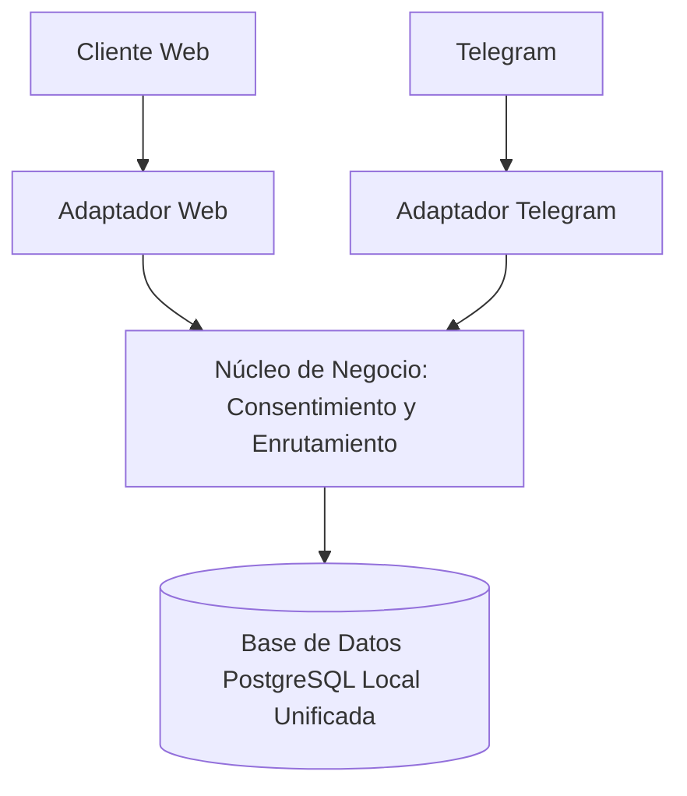

<!--
Agente: Architecture Agent
Proveedor: gemini
Modelo: gemini-3.5-flash-lite
Fecha: 2026-10-07 18:51
Petición: Respuestas del equipo. ARCH-Q-001: Para el prototipo usamos una base de datos relacional local única (PostgreSQL), compartida por los adaptadores de canal, un solo esquema de datos, sin desacoplar servicios de datos, por el plazo de 8 semanas y el equipo de cuatro personas. ARCH-Q-002: Se permiten logs técnicos genéricos de infraestructura, sin incluir datos de salud ni identificadores de Telegram; está prohibida cualquier auditoría específica del enrutamiento de mensajes, no registrar nada de eso.
-->

# ARQ-001. Enrutamiento, Consentimiento y Canales en Pharma Express - Versión 1.0

Estado: Candidata
Modo: Propuesta
SPECs de origen: SPEC-001, SPEC-002

## Resumen de la decisión
Un monolito modular con base de datos relacional local única que separa los adaptadores de canal (Web y Telegram) del núcleo de negocio, aplicando un esquema de datos unificado y cumpliendo estrictamente con las restricciones de almacenamiento, el ciclo de vida de la vinculación a tres meses y la prohibición de auditorías sobre identificadores de Telegram.

## Architecture Drivers
- Driver: Seguridad y Privacidad de Datos de Salud. Pregunta: ¿Cómo asegurar que ningún dato personal o de salud sea solicitado o procesado sin la aceptación previa del aviso de privacidad y cómo evitar que los identificadores de Telegram se traten como credenciales de identidad? Origen: SPEC-001/RF-001, SPEC-001/RF-002, SPEC-002/RF-007, contexto 3.11.
- Driver: Modificabilidad e Interoperabilidad de Canales. Pregunta: ¿Cómo estructurar el sistema para soportar de manera independiente la presentación del aviso de privacidad y el enrutamiento de mensajes tanto en la aplicación web como en el bot de Telegram? Origen: SPEC-001/RF-004, SPEC-002/RF-006, contexto 3.1.
- Driver: Restricción de Tiempo y Equipo. Pregunta: ¿Cómo simplificar la arquitectura para cumplir con el desarrollo en 8 semanas con un equipo de 4 personas sin introducir complejidad innecesaria? Origen: Contexto 3.9.

## Restricciones arquitectónicas
- Ley 1581 de 2012 y Decreto 1377 de 2013: Obligatoriedad de la autorización explícita para el tratamiento de datos sensibles de salud. Origen: SPEC-001 sección 13, contexto 3.11.
- El equipo no tiene acceso a los sistemas de Disfarma y trabaja desde afuera, simulando los servicios necesarios. Origen: Contexto 3.9.
- Los identificadores de Telegram no son fuente de identidad ni deben ser almacenados como credenciales. Origen: SPEC-002 sección 13, contexto 2.3.
- Uso de una base de datos relacional local única (PostgreSQL), compartida por los adaptadores de canal, con un solo esquema de datos y sin desacoplar servicios de datos. Origen: Respuesta del equipo a ARCH-Q-001.
- Prohibición de auditorías específicas del enrutamiento de mensajes y exclusión de datos de salud o identificadores de Telegram en los logs, permitiendo únicamente logs técnicos genéricos de infraestructura. Origen: Respuesta del equipo a ARCH-Q-002.

## Atributos de calidad
- Atributo: Usabilidad y Accesibilidad. Condición: El aviso de privacidad y la declaración de autorización deben presentarse de forma clara y accesible tanto en pantallas web como en mensajes de texto del bot de Telegram. Origen: SPEC-001/RNF-001.
- Atributo: Seguridad. Condición: Los identificadores de transporte de Telegram no deben almacenarse ni tratarse como credenciales de autenticación ni de identidad bajo ninguna circunstancia. Origen: SPEC-002/RNF-002.

## Preguntas de aclaración
- ARCH-Q-001. Las SPECs indican que la aceptación del aviso de privacidad se realiza por plataforma y que la vinculación de Telegram o navegador tiene una vigencia de 3 meses. ¿El almacenamiento de la aceptación del aviso de privacidad debe estar acoplado al ciclo de vida de la vinculación del canal o debe gestionarse como una entidad de consentimiento independiente por plataforma?
  Por qué importa: Define si el modelo de datos requiere una tabla de consentimientos separada por canal y plataforma o si se integra directamente en la sesión o registro de vinculación del canal.
  Crítica: sí
  Estado: Respondida (Para el prototipo usamos una base de datos relacional local única (PostgreSQL), compartida por los adaptadores de canal, un solo esquema de datos, sin desacoplar servicios de datos, por el plazo de 8 semanas y el equipo de cuatro personas.)
  Responsable: equipo
- ARCH-Q-002. SPEC-002/RF-009 especifica que no se deben registrar eventos ni auditorías específicos del uso de los identificadores de Telegram para enrutar mensajes a un paciente vinculado. ¿Esta restricción aplica únicamente a los logs de transmsión de mensajes o se extiende también a la prohibición de registrar trazas técnicas de depuración (debugging) a nivel de infraestructura?
  Por qué importa: Afecta la configuración de los componentes de observabilidad y registro de errores en el adaptador de Telegram.
  Crítica: sí
  Estado: Respondida (Se permiten logs técnicos genéricos de infraestructura, sin incluir datos de salud ni identificadores de Telegram; está prohibida cualquier auditoría específica del enrutamiento de mensajes, no registrar nada de eso.)
  Responsable: equipo

## Alternativas consideradas
- Alternativa: Microservicios distribuidos con bases de datos independientes. Descripción: Separar el servicio de canales, el servicio de consentimiento y el servicio de enrutamiento en procesos independientes con almacenamiento aislado. Ventajas: Alta escalabilidad y aislamiento estricto. Desventajas: Exceso de complejidad operativa, inviable para un equipo de 4 personas en 8 semanas (contexto 3.9).
- Alternativa: Monolito Modular con Base de Datos Relacional Única. Descripción: Un único despliegue con módulos internos definidos para adaptadores de canal, consentimiento y enrutamiento, compartiendo una base de datos PostgreSQL local con un esquema unificado. Ventajas: Simplicidad de desarrollo, menor sobrecarga operativa, alineado con el tiempo de 8 semanas y el tamaño del equipo. Desventajas: Acoplamiento a nivel de persistencia.

## Matriz de decisión
| Alternativa | Mantenibilidad (0.3) | Seguridad (0.3) | Complejidad (0.2) | Tiempo (0.2) | Total |
|---|---|---|---|---|---|
| Microservicios distribuidos | 3 | 4 | 2 | 1 | 2.6 |
| Monolito Modular (BD Única) | 4 | 4 | 4 | 4 | 4.0 |

Pesos justificados: la seguridad pesa 0.3 por el contexto normativo (3.11) y la protección de datos sensibles; la mantenibilidad pesa 0.3 debido a las restricciones de recursos del equipo (4 personas y 8 semanas en contexto 3.9); la complejidad y el tiempo pesan 0.2 cada uno para asegurar la entrega del prototipo dentro del plazo establecido.

## Arquitectura seleccionada
- Decisión: Monolito Modular con base de datos relacional local única (PostgreSQL) y módulos lógicos para adaptadores de canal, consentimiento y enrutamiento.
- Por qué: Satisface los requerimientos de separación de canales e identidad sin introducir la complejidad de microservicios, cumpliendo de forma directa con las restricciones de tiempo (8 semanas), equipo (4 personas) y la infraestructura local indicada en la respuesta a ARCH-Q-001.
- ADR: ADR-001.

## Diagrama conceptual

## Componentes y responsabilidades
- COMP-001. Adaptador Web: Gestiona la interfaz y la presentación del aviso de privacidad y la interacción HTTP para la vinculación del navegador. Traza a: SPEC-001/RF-001, Driver Modificabilidad e Interoperabilidad de Canales, ADR-001.
- COMP-002. Adaptador Telegram: Gestiona la recepción y envío de mensajes a través de la API de Telegram, aplicando la restricción de exclusión de logs específicos de enrutamiento. Traza a: SPEC-002/RF-006, Driver Seguridad y Privacidad de Datos de Salud, ADR-001.
- COMP-003. Módulo de Consentimiento: Administra la aceptación explícita del aviso de privacidad por plataforma y canal según la Ley 1581 de 2012. Traza a: SPEC-001/RF-002, Driver Seguridad y Privacidad de Datos de Salud, ADR-001.
- COMP-004. Módulo de Enrutamiento y Vinculación: Valida la vigencia de tres meses de la vinculación y enruta los mensajes hacia el paciente sin almacenar identificadores de Telegram como credenciales. Traza a: SPEC-002/RF-007, Driver Seguridad y Privacidad de Datos de Salud, ADR-001.
- COMP-005. Capa de Persistencia Unificada: Base de datos PostgreSQL local que almacena los registros de consentimiento y vinculaciones en un esquema único. Traza a: Restricción arquitectónica de BD unificada, ADR-001.

## Integraciones y flujos técnicos
- Flujo de Presentación de Consentimiento y Vinculación: El usuario accede mediante el Adaptador Web o el Adaptador Telegram; el Módulo de Consentimiento valida la aceptación del aviso antes de permitir cualquier operación, y el Módulo de Enrutamiento registra la vinculación con vigencia de tres meses en la base de datos PostgreSQL. Origen: SPEC-001/RF-001, SPEC-002/RF-006.
- Envío de mensajes por Telegram: El Adaptador Telegram procesa la comunicación utilizando únicamente logs técnicos genéricos de infraestructura, sin registrar trazas específicas de enrutamiento de mensajes. Origen: SPEC-002/RF-009, respuesta ARCH-Q-002.

## ADR
- ADR-001. Selección de Monolito Modular con Base de Datos Única para Canales y Consentimiento
  Estado: Propuesta
  Contexto: Necesidad de implementar un prototipo funcional en 8 semanas con un equipo de 4 personas, garantizando la separación de canales (Web y Telegram), la gestión de consentimiento por plataforma y el cumplimiento normativo de privacidad sin sobreingeniería.
  Problema: Cómo estructurar la aplicación para soportar múltiples adaptadores de canal y almacenamiento de consentimientos de forma segura y mantenible dentro de las restricciones de recursos del proyecto.
  Alternativas: Microservicios distribuidos con bases de datos independientes; Monolito Modular con base de datos relacional local única (PostgreSQL).
  Decisión: Monolito Modular con base de datos relacional local única (PostgreSQL) y esquema unificado.
  Justificación: Maximiza la velocidad de desarrollo y simplifica la operación técnica para cumplir el plazo de 8 semanas, manteniendo fronteras lógicas claras entre adaptadores y dominio sin incurrir en la complejidad de despliegues distribuidos.
  Consecuencias positivas: Menor sobrecarga operativa, facilidad de despliegue local, cumplimiento de las restricciones de equipo y tiempo.
  Consecuencias negativas: Acoplamiento a nivel de persistencia en una única base de datos relacional.
  Supuestos: Una base de datos PostgreSQL local es suficiente para simular la persistencia requerida durante el desarrollo del prototipo.
  Evidencia: Contexto 3.9 (equipo de 4 personas y 8 semanas) y respuesta del equipo a ARCH-Q-001.

## Decisiones de diseño y patrones
- Patrón Repository: Se utiliza para abstraer el acceso a la base de datos PostgreSQL unificada, permitiendo consultar y persistir el estado de las vinculaciones y consentimientos desde los diferentes módulos lógicos. Traza a: SPEC-001/RF-002, SPEC-002/RF-007.

## Riesgos técnicos
- Riesgo: Acoplamiento excesivo entre módulos debido al uso de un esquema de base de datos único. Impacto: Medio. Probabilidad: Media. Mitigación: Definir límites estrictos de paquetes o módulos lógicos en el código fuente para evitar dependencias directas entre adaptadores de canal y la lógica de negocio interna.
- Riesgo: Infracción accidental de la restricción de auditoría en Telegram mediante librerías de terceros. Impacto: Alto. Probabilidad: Baja. Mitigación: Configuración explícita y revisión de los niveles de log del framework de infraestructura para prohibir registros específicos de mensajes.

## Supuestos
- La base de datos PostgreSQL local estará disponible en el entorno de desarrollo y pruebas del equipo. Requiere validación: Equipo de desarrollo (pendiente de Planning/QA).
- Las APIs de Telegram operarán de manera estable durante el periodo de desarrollo del prototipo. Requiere validación: Pruebas de integración simuladas (pendiente de Planning/QA).

## Preguntas técnicas abiertas
- Ninguna pregunta técnica abierta pendiente tras las respuestas del equipo a ARCH-Q-001 y ARCH-Q-002. Origen: Respuestas del equipo.

## Trazabilidad
- SPEC-001/RF-001 → Driver Modificabilidad e Interoperabilidad de Canales → ADR-001 → COMP-001 → Implementación/TEST (pendiente de Planning/QA).
- SPEC-001/RF-002 → Driver Seguridad y Privacidad de Datos de Salud → ADR-001 → COMP-003 → Implementación/TEST (pendiente de Planning/QA).
- SPEC-002/RF-006 → Driver Modificabilidad e Interoperabilidad de Canales → ADR-001 → COMP-002 → Implementación/TEST (pendiente de Planning/QA).
- SPEC-002/RF-007 → Driver Seguridad y Privacidad de Datos de Salud → ADR-001 → COMP-004 → Implementación/TEST (pendiente de Planning/QA).
- SPEC-002/RF-009 → Restricción de logs y auditoría → ADR-001 → COMP-002 → Implementación/TEST (pendiente de Planning/QA).
- ARCH-Q-001 (respuesta del equipo) → Restricción de BD unificada → ADR-001 → COMP-005 → Implementación/TEST (pendiente de Planning/QA).
- ARCH-Q-002 (respuesta del equipo) → Restricción de logs técnicos genéricos → ADR-001 → COMP-002 → Implementación/TEST (pendiente de Planning/QA).

## Verificación
- Completitud: Cumple. Todas las secciones requeridas contienen información detallada y real basada en las SPECs y el contexto, sin marcadores temporales o de tipo TBD.
- Consistencia con las SPECs: Cumple. Los drivers, restricciones y componentes se trazan directamente a los requisitos funcionales de SPEC-001 y SPEC-002, así como a las respuestas del equipo.
- No invención: Cumple. Las tecnologías seleccionadas (PostgreSQL) y las decisiones estructurales provienen explícitamente de las respuestas del equipo a las preguntas de aclaración y del contexto del producto.
- Justificación: Cumple. Todas las alternativas han sido evaluadas mediante una matriz ponderada justificada por los drivers de tiempo, equipo y seguridad.
- Defensa: Cumple. Cada decisión arquitectónica cuenta con su respectivo ADR y su justificación técnica sustentada en las restricciones del proyecto y el dominio farmacéutico.

## Historial de cambios
- Versión 0.1: Estudio de análisis inicial a partir de SPEC-001 y SPEC-002.
- Versión 1.0: Propuesta arquitectónica completa incorporando las respuestas del equipo a ARCH-Q-001 y ARCH-Q-002.

## Siguiente paso
La ARQ-001 versión 1.0 está lista para revisión. Confírmenla o pidan correcciones con --continuar ARQ-001.
